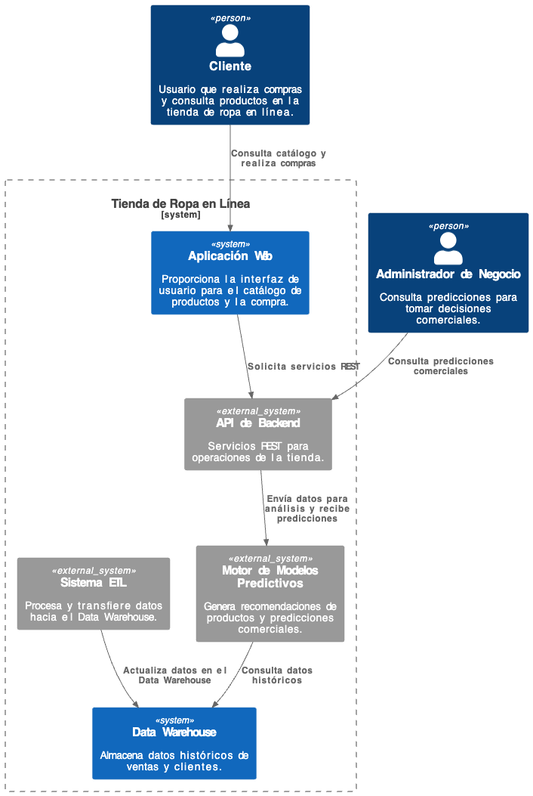

Un Diagrama de Contexto es una representación gráfica de alto nivel que muestra el sistema principal en estudio, sus límites, y las interacciones con actores externos (entidades externas) como usuarios, organizaciones o sistemas externos. Este diagrama permite visualizar el flujo de información entre el sistema central y su entorno, proporcionando una visión clara y simple de cómo el sistema se integra dentro de su contexto.

# Descripción de Componentes

## Usuario (Cliente de la Tienda)  
Interactúa con la tienda en línea para navegar, comprar y recibir recomendaciones personalizadas.

## Tienda de Ropa en Línea  
Aplicación web que sirve como interfaz principal para los clientes, proporcionando un catálogo de productos y una experiencia de compra.

## API de Backend  
Expone servicios REST para la interacción con el catálogo de productos, el procesamiento de pagos y la consulta de datos analíticos.

## Motor de Modelos Predictivos  
Consume datos históricos de ventas para generar recomendaciones de productos y predicciones de tendencias comerciales.

## Data Warehouse  
Repositorio de datos estructurados que almacena la información histórica de ventas, clientes y productos.

## Sistema de Integración ETL  
Extrae, transforma y carga los datos desde múltiples fuentes hacia el Data Warehouse para mantenerlos actualizados.

## Administrador de Negocio  
Usuario interno que consulta las predicciones y toma decisiones comerciales basadas en la analítica.
