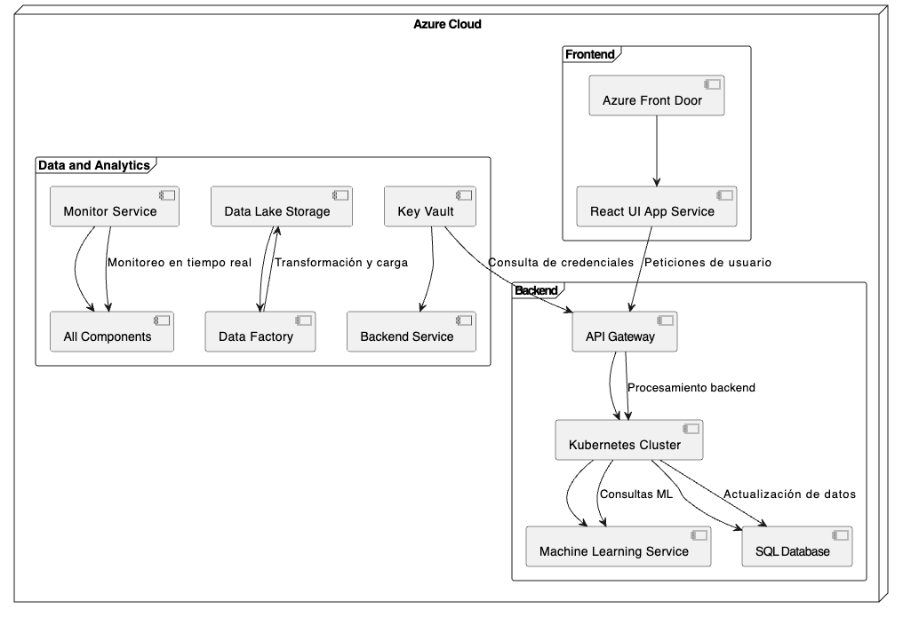

# Descripción de Nodos y Componentes
# Región de Azure:
## Azure Front Door
Distribución global de tráfico con balanceo de carga.

## App Service (Frontend)
Hospedaje del frontend basado en React.

## App Service (Backend API)
Hospedaje del API Gateway y los microservicios backend.

## Azure Kubernetes Service (AKS)
Ejecución de contenedores para los microservicios de productos, recomendaciones y análisis.

## Azure Machine Learning Service
Proporciona un entorno para el despliegue y administración de modelos predictivos.

## Azure SQL Database
Base de datos relacional para transacciones de la tienda.

## Azure Data Lake
Almacenamiento de datos para análisis y reportes.

## Azure Data Factory
Pipeline de integración para el sistema ETL.

## Azure Application Insights
Monitoreo de aplicaciones y métricas.

## Azure Key Vault
Almacenamiento seguro de credenciales y secretos.
