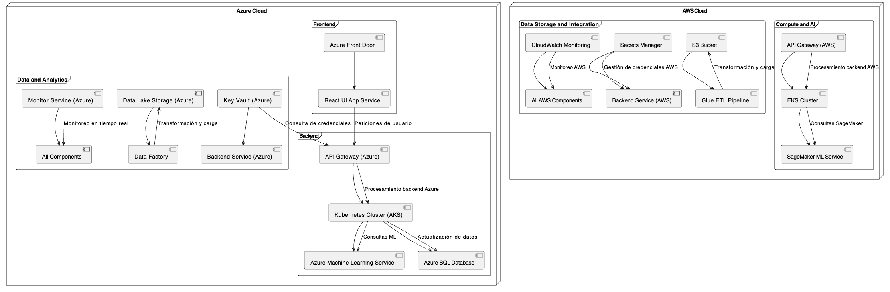

# Justificación Tecnológica

La inclusión de AWS junto con Azure en la arquitectura de la solución responde a los siguientes aspectos técnicos y estratégicos:

## **Aspectos Técnicos**

- **Computación distribuida:**  
  El uso de Kubernetes (AKS y EKS) permite balancear cargas de trabajo y mantener alta disponibilidad de servicios, garantizando escalabilidad horizontal.

- **Procesamiento de Machine Learning:**  
  Amazon SageMaker complementa los servicios de ML de Azure, proporcionando modelos preentrenados, escalabilidad y herramientas avanzadas para entrenamiento y despliegue de modelos.

- **Almacenamiento eficiente:**  
  AWS S3 es un estándar para almacenamiento de datos no estructurados, proporcionando alta durabilidad y capacidad de integración con pipelines de ETL como Glue.

- **Redundancia y Disaster Recovery:**  
  La arquitectura multicloud mejora la tolerancia a fallos y permite tener recuperación ante desastres al distribuir los servicios en diferentes proveedores.

## **Aspectos Estratégicos de Negocio**

- **Negociación de costos:**  
  Permite aprovechar las políticas de precios competitivas de ambos proveedores, generando ahorros significativos en infraestructura.

- **Cumplimiento normativo:**  
  Facilita la adopción de normativas de datos específicas en regiones cubiertas por AWS y Azure, mejorando la conformidad con estándares de la industria.

- **Reducción del vendor lock-in:**  
  Se minimiza la dependencia de un único proveedor de nube, otorgando flexibilidad para adaptarse a cambios tecnológicos o estrategias futuras.

Esta combinación tecnológica busca maximizar los beneficios técnicos y estratégicos, ofreciendo una solución robusta, escalable y económicamente viable para el negocio.
