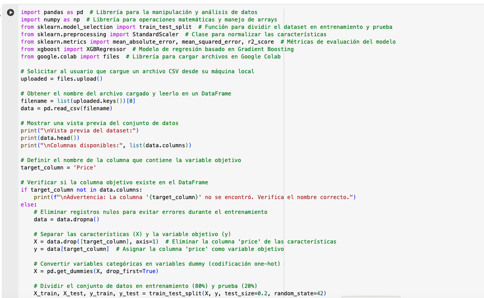

El código está en la siguiente URL:

https://colab.research.google.com/drive/1I3dbvv5aKvLOCKLOSGJ8UwRhQnkzzKRp

## Preprocesamiento: 
La eliminación de valores nulos y la normalización de datos son pasos críticos para evitar errores y mejorar la estabilidad del modelo.
## XGBoost: 
El uso de este algoritmo permite capturar relaciones complejas entre las variables, gracias a su enfoque de ensamble de árboles de decisión.
## Evaluación: 
Las métricas presentadas ayudan a comprender el rendimiento del modelo desde diferentes perspectivas.

Resultados:

El rendimiento de tu modelo XGBoost con las métricas obtenidas puede interpretarse de la siguiente manera:

## MAE (Mean Absolute Error): 51.4378
Esto significa que, en promedio, el modelo se equivoca por aproximadamente 51.44 unidades del precio real. Un valor menor sería deseable.

## MSE (Mean Squared Error): 3884.6299
Penaliza los errores grandes más que el MAE debido a la elevación al cuadrado. Esto sugiere que hay errores significativos en las predicciones.

## RMSE (Root Mean Squared Error): 62.3268
La raíz cuadrada del MSE devuelve el error en la misma escala que el precio. Un error de 62.33 unidades indica que las predicciones están muy dispersas respecto a los valores reales.

## R² (Coeficiente de Determinación): -0.3256
Un valor negativo indica que el modelo es peor que simplemente usar la media de los precios como predicción. El modelo no captura la variabilidad de los datos de manera efectiva, lo cual sugiere que el ajuste no es bueno.
