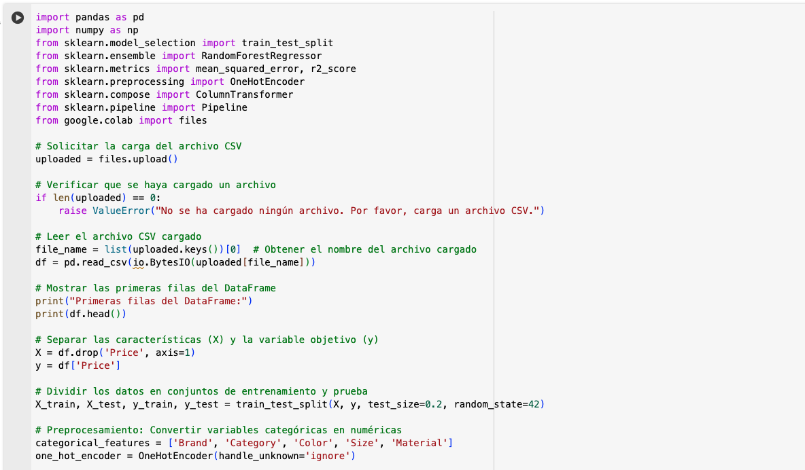

El código está en la siguiente URL:

https://colab.research.google.com/drive/1C_isBpfQv9c5RJdo_JuoWVbtSfmZo1Y_#scrollTo=LQ0eqGCleTiP

Para entrenar un modelo de Machine Learning que prediga los precios basado en el archivo CSV proporcionado, seguí los siguientes pasos:

## Preprocesamiento de datos: 
Convertiremos las variables categóricas en numéricas usando técnicas como One-Hot Encoding o Label Encoding.

## Selección del modelo: 
Utilizaremos un modelo de regresión, como Random Forest Regressor, que es adecuado para problemas de regresión y maneja bien las variables categóricas.

## Evaluación del modelo: 
Evaluaremos el modelo usando métricas como el Error Cuadrático Medio (MSE) y el Coeficiente de Determinación (R²).

Resultados:

## Justificación del modelo seleccionado:
1. Random Forest Regressor: Este modelo es adecuado para problemas de regresión y maneja bien las variables categóricas. Además, es robusto frente al sobreajuste y puede capturar relaciones no lineales entre las características y la variable objetivo.
2. One-Hot Encoding: Esta técnica es útil para convertir variables categóricas en un formato que pueda ser proporcionado a los modelos de Machine Learning, ya que estos modelos no pueden trabajar directamente con datos categóricos.

## Evaluación del rendimiento:
1. Error Cuadrático Medio (MSE): Mide el promedio de los errores al cuadrado entre los valores reales y los predichos. Un MSE más bajo indica un mejor ajuste del modelo.
2. Coeficiente de Determinación (R²): Indica la proporción de la varianza en la variable dependiente que es predecible a partir de las variables independientes. Un valor de R² cercano a 1 indica un buen ajuste del modelo.

