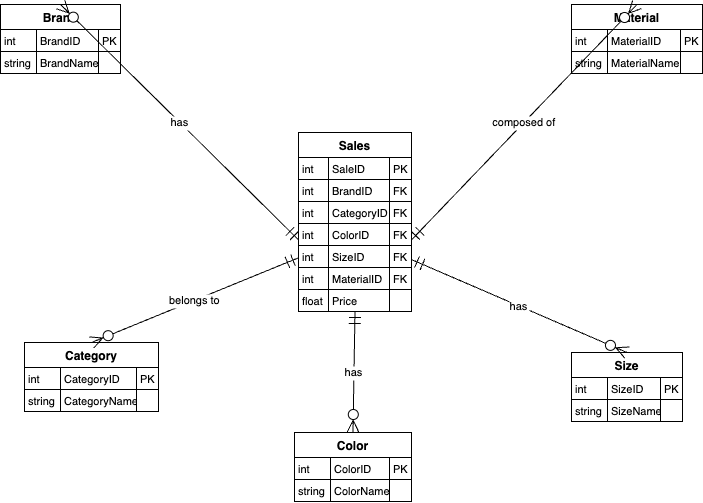

| Tabla      | Descripción                                                        |
|------------|--------------------------------------------------------------------|
| Sales      | Tabla de hechos que almacena las ventas y sus atributos asociados |
| Brand      | Tabla de dimensión que almacena las marcas de los productos       |
| Category   | Tabla de dimensión que almacena las categorías de productos       |
| Color      | Tabla de dimensión que almacena los colores de los productos      |
| Size       | Tabla de dimensión que almacena los tamaños de los productos      |
| Material   | Tabla de dimensión que almacena los materiales de los productos   |

### Detalle de Columnas

#### Sales
| Columna     | Descripción                                      |
|-------------|--------------------------------------------------|
| SaleID      | Identificador único de la venta                  |
| BrandID     | Identificador de la marca (FK hacia Brand)       |
| CategoryID  | Identificador de la categoría (FK hacia Category)|
| ColorID     | Identificador del color (FK hacia Color)         |
| SizeID      | Identificador del tamaño (FK hacia Size)         |
| MaterialID  | Identificador del material (FK hacia Material)   |
| Price       | Precio del artículo vendido                      |

#### Brand
| Columna     | Descripción                                      |
|-------------|--------------------------------------------------|
| BrandID     | Identificador único de la marca                  |
| BrandName   | Nombre de la marca                                |

#### Category
| Columna     | Descripción                                      |
|-------------|--------------------------------------------------|
| CategoryID  | Identificador único de la categoría              |
| CategoryName| Nombre de la categoría                           |

#### Color
| Columna     | Descripción                                      |
|-------------|--------------------------------------------------|
| ColorID     | Identificador único del color                    |
| ColorName   | Nombre del color                                 |

#### Size
| Columna     | Descripción                                      |
|-------------|--------------------------------------------------|
| SizeID      | Identificador único del tamaño                   |
| SizeName    | Nombre del tamaño                                 |

#### Material
| Columna     | Descripción                                      |
|-------------|--------------------------------------------------|
| MaterialID  | Identificador único del material                 |
| MaterialName| Nombre del material                               |
