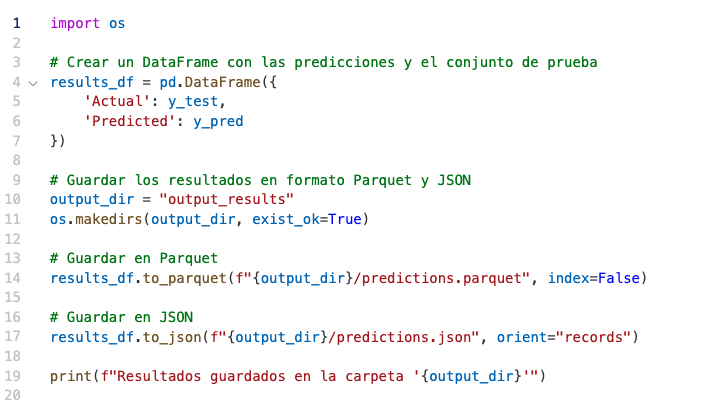

# 1. Almacenamiento de Datos Transformados y Resultados
   
Para centralizar los datos y resultados en formatos eficientes como Parquet o JSON, podemos implementar el siguiente código al final del entrenamiento del modelo:

Ventajas de los Formatos
## Parquet: 
Alta eficiencia en almacenamiento y lectura debido a su estructura columnar. Ideal para grandes volúmenes de datos en análisis distribuidos.

## JSON: 
Fácil de leer, interpretar y compatible con APIs y servicios RESTful.

# 2. Integración en un Pipeline Automatizado para la Nube

## Pasos Generales para la Integración
1. Pipeline CI/CD: Configurar herramientas como GitHub Actions, Jenkins o GitLab CI para automatizar el entrenamiento del modelo y el almacenamiento de los resultados.
2. Servicios de Nube Pública: Utilizar los SDKs de los principales proveedores de nube:
AWS: boto3
Azure: azure-storage-blob
Google Cloud: google-cloud-storage
3. Almacenamiento en Buckets: Guardar los resultados en buckets centralizados en cada proveedor.
