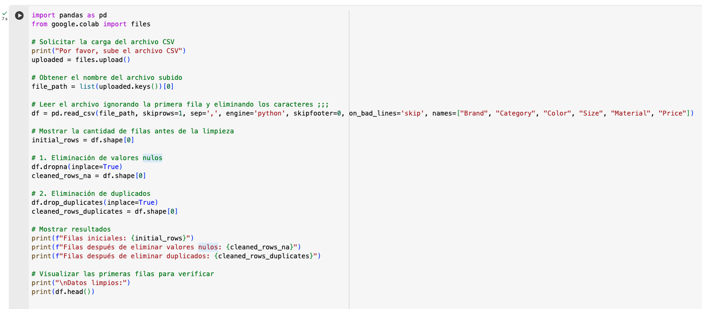
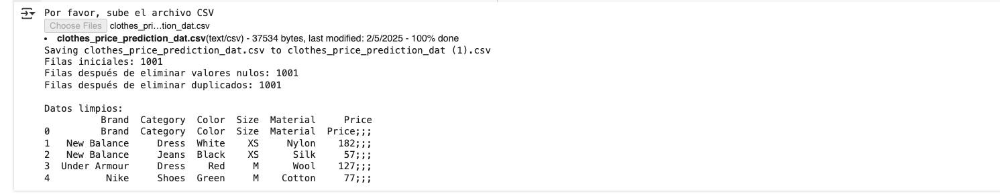

El código fuente está en la siguiente URL:

https://colab.research.google.com/drive/1s-7eLWqdCJ3gJ-1JmR49eh7xtPTaNUed#scrollTo=Ulghbf5S8n_9

# En resumen:

## Carga del archivo: 
Se omite la primera fila y se leen los datos con las columnas especificadas.

## Eliminación de valores nulos: 
Se utiliza dropna() para eliminar filas con valores faltantes.

## Eliminación de duplicados: 
Se aplica drop_duplicates() para remover registros repetidos.

## Conteo de filas: 
Se muestra la cantidad de filas antes y después de cada operación.
