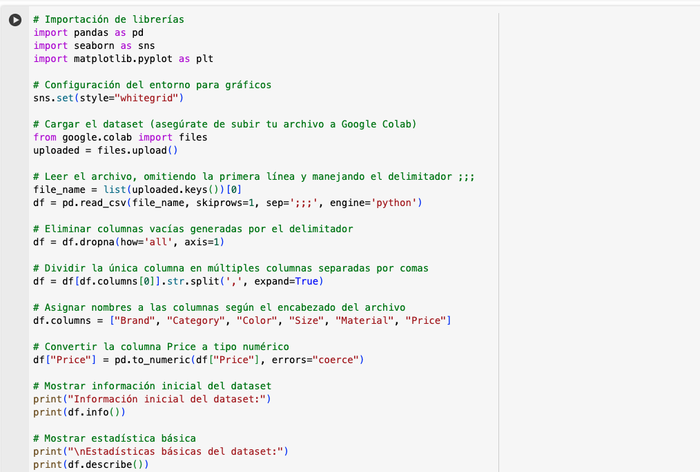
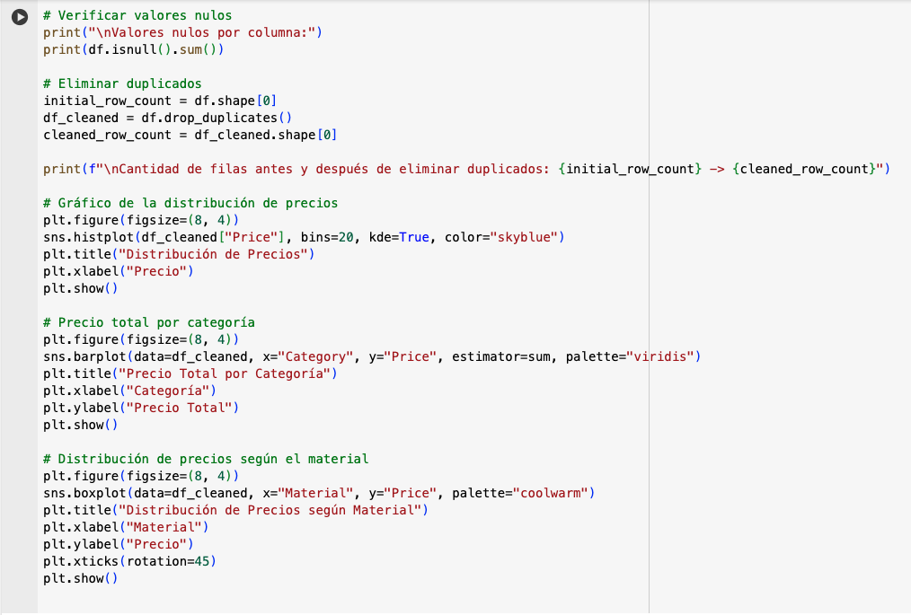
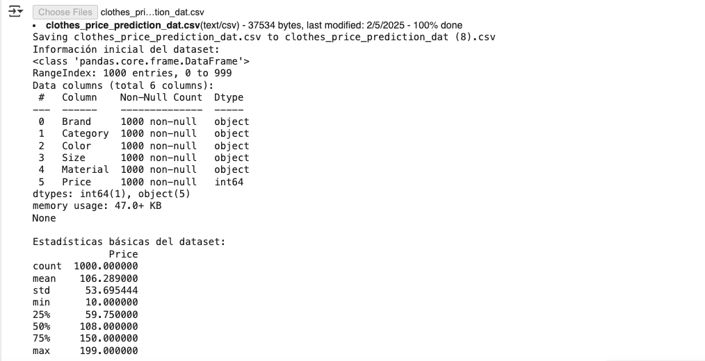
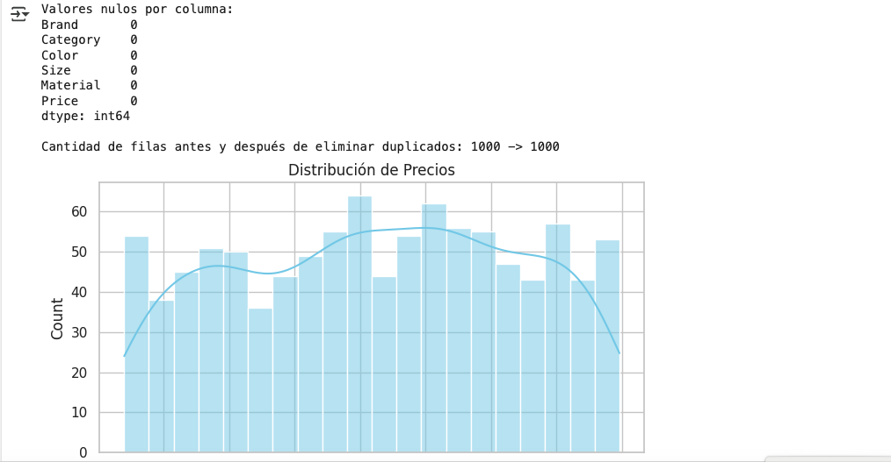
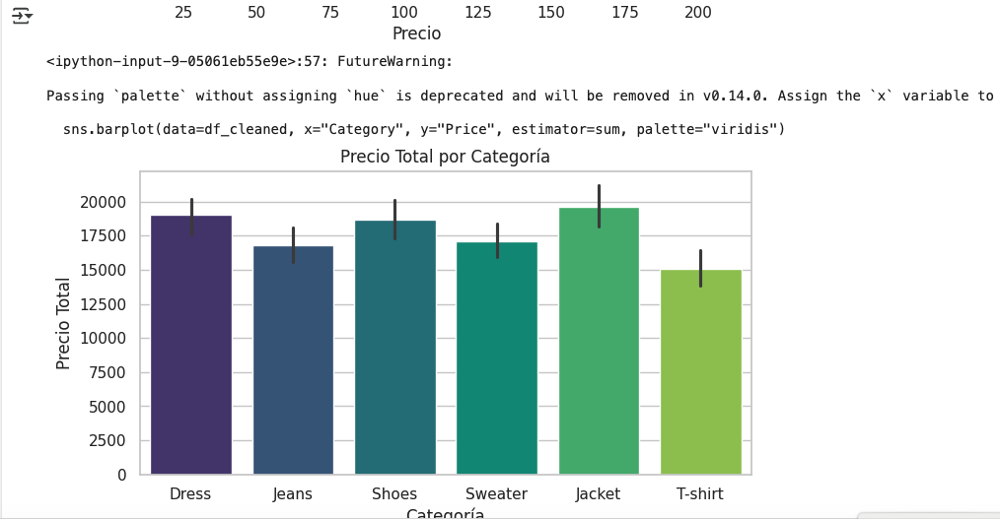
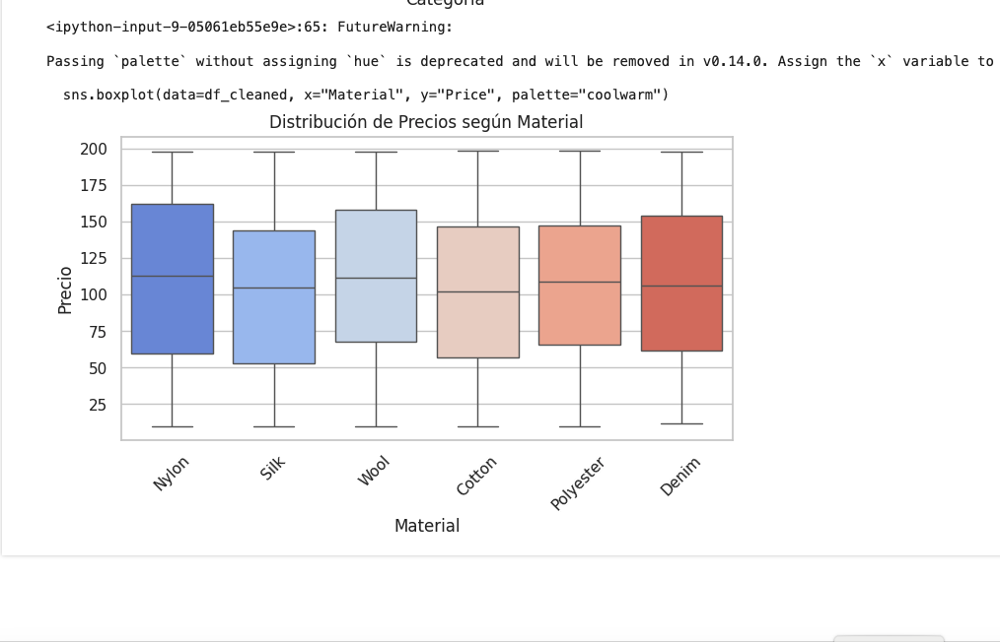

El código fuente está en la siguinete URL:

https://colab.research.google.com/drive/1j-BLBG6vgXuouAjLLTKljmqd2JfjFXLA

El gráfico muestra una distribución de precios, donde la mayoría de los productos se concentran entre precios bajos y medios. Existen pocos productos con precios altos, lo cual indica una distribución sesgada hacia precios económicos.

Este gráfico permite identificar las categorías con mayor valor total en precios. Las categorías con barras más altas son las que contienen productos más costosos o en mayor cantidad dentro del catálogo.

Este gráfico de caja y bigotes muestra la variabilidad de precios según el material. Los materiales como 'Silk' y 'Wool' presentan precios más altos y una mayor dispersión, mientras que materiales como 'Nylon' y 'Cotton' se concentran en precios más bajos.
